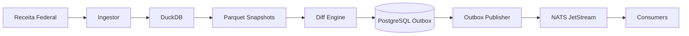

# cnpj-data-publisher

Serviço independente que descobre, baixa, normaliza e publica eventos das
empresas brasileiras a partir dos **Dados Abertos do CNPJ** da Receita Federal.

Os consumidores integram exclusivamente por **NATS JetStream**. Este projeto
não conhece, importa nem depende de nenhum sistema de enriquecimento.



## Sumário

- [Objetivo](#objetivo)
- [Arquitetura](#arquitetura)
- [Fonte dos dados](#fonte-dos-dados)
- [Estrutura dos snapshots](#estrutura-dos-snapshots)
- [Contratos NATS](#contratos-nats)
- [Execução local](#execução-local)
- [Execução com Docker](#execução-com-docker)
- [Deploy em K3s](#deploy-em-k3s)
- [Ingestão manual](#ingestão-manual)
- [Backfill](#backfill)
- [Retenção](#retenção)
- [Observabilidade](#observabilidade)
- [Troubleshooting](#troubleshooting)

## Objetivo

1. Descobrir o snapshot mensal mais recente dos Dados Abertos do CNPJ.
2. Baixar os arquivos necessários com verificação de integridade.
3. Extrair, normalizar e gerar um snapshot canônico em Parquet.
4. Comparar com o snapshot anterior e detectar empresas novas, alteradas,
   reativadas e inativadas.
5. Publicar eventos no NATS JetStream via *outbox pattern*.
6. Oferecer backfill controlado e resumível das empresas ativas.

**Fora de escopo:** descoberta de domínios, redes sociais, validação de e-mail,
lead score, enriquecimento de qualquer natureza.

## Arquitetura

| Componente | Tipo | Responsabilidade |
| --- | --- | --- |
| `ingest` | Job / CronJob | pipeline completo de ingestão mensal |
| `publish-outbox` | Deployment | publica eventos pendentes no JetStream |
| `backfill` | Job opcional | publica empresas ativas com rate limit |
| `migrate` | Job | aplica migrations Alembic |
| `cleanup` | Job opcional | aplica políticas de retenção |

Todos usam a **mesma imagem Docker** com comandos diferentes.

Estágios da ingestão:

```
DISCOVERED → DOWNLOADING → DOWNLOADED → EXTRACTING → NORMALIZING
          → VALIDATING → DIFFING → CREATING_EVENTS → COMPLETED
```

## Fonte dos dados

Base pública da Receita Federal, publicada mensalmente em diretórios `YYYY-MM`.

```
RECEITA_BASE_URL=https://arquivos.receitafederal.gov.br/dados/cnpj/dados_abertos_cnpj
```

Arquivos mínimos para considerar um snapshot completo:

`Empresas*.zip`, `Estabelecimentos*.zip`, `Cnaes.zip`, `Municipios.zip`,
`Naturezas*.zip`, `Paises*.zip`, `Qualificacoes*.zip`, `Simples.zip`

Sócios são opcionais (`RECEITA_INCLUDE_PARTNERS=true` habilita `Socios*.zip`).

## Estrutura dos snapshots

```
/data/
├── downloads/2026-07/
├── extracted/2026-07/
├── snapshots/2026-07/
│   ├── manifest.json
│   ├── all/state=SP/…
│   └── active/state=SP/…
├── diffs/2026-07/
│   ├── discovered.parquet
│   ├── updated.parquet
│   ├── reactivated.parquet
│   ├── inactivated.parquet
│   └── manifest.json
├── rejected/2026-07/
└── temporary/
```

O snapshot é construído em `snapshots/<versão>-building/` e promovido por
`rename` atômico somente após validação completa.

## Contratos NATS

Stream `BRAZIL_COMPANY_EVENTS`, subjects `company.br.cnpj.>`.

| Subject | Evento |
| --- | --- |
| `company.br.cnpj.discovered.v1` | `COMPANY_DISCOVERED` |
| `company.br.cnpj.updated.v1` | `COMPANY_UPDATED` |
| `company.br.cnpj.reactivated.v1` | `COMPANY_REACTIVATED` |
| `company.br.cnpj.inactivated.v1` | `COMPANY_INACTIVATED` |
| `company.br.cnpj.snapshot.ready.v1` | `CNPJ_SNAPSHOT_READY` |
| `company.br.cnpj.ingest.completed.v1` | `INGEST_COMPLETED` |
| `company.br.cnpj.ingest.failed.v1` | `INGEST_FAILED` |

Os JSON Schemas em [`contracts/`](contracts/) são a fonte de verdade. `v1`
nunca muda de forma incompatível.

Garantia de entrega: **at-least-once**. `Nats-Msg-Id` recebe o `event_id`
e o stream usa `duplicate_window` de 24h. Consumidores devem ser idempotentes.

## Execução local

```bash
make setup                     # venv + dependências de desenvolvimento
cp .env.example .env
docker compose up -d postgres nats
make migrate
make test-unit
```

## Execução com Docker

```bash
docker compose up -d postgres nats
docker compose run --rm app migrate
docker compose run --rm app ingest --snapshot latest
docker compose up -d outbox-publisher
```

## Deploy em K3s

```bash
make helm-lint
make helm-template
make k3s-install NAMESPACE=cnpj-data
```

`values-k3s.yaml` habilita PostgreSQL e NATS embarcados com `local-path` PVC.

Para usar NATS/PostgreSQL externos, desabilite as dependências e aponte para os
Secrets existentes:

```yaml
postgresql:
  enabled: false
externalPostgresql:
  secretName: cnpj-data-publisher-postgresql
  secretKey: database-url

nats:
  enabled: false
externalNats:
  secretName: cnpj-data-publisher-nats
  urlKey: url
  credentialsKey: credentials
```

MinIO (ou qualquer S3) é configurado por `STORAGE_BACKEND=S3` mais as variáveis
`S3_*`. `S3_FORCE_PATH_STYLE=true` é necessário para MinIO.

### Google Cloud Storage (GCS)

Duas opções para publicar no GCS:

1. **Backend nativo (recomendado)** — `STORAGE_BACKEND=GCS`, usando o SDK
   `google-cloud-storage`. Instale o extra e configure:

   ```bash
   pip install -e '.[gcs]'
   ```

   ```
   STORAGE_BACKEND=GCS
   GCS_BUCKET=meu-bucket
   GCS_PROJECT=meu-projeto
   GOOGLE_APPLICATION_CREDENTIALS=/secrets/sa.json   # vazio = Workload Identity
   ```

   No GKE, prefira **Workload Identity** e deixe `GOOGLE_APPLICATION_CREDENTIALS`
   vazio. A service account precisa de `roles/storage.objectAdmin` no bucket.

2. **S3-interop (sem código extra)** — usa o mesmo backend S3 apontando para o
   endpoint compatível do GCS, com **chaves HMAC**:

   ```
   STORAGE_BACKEND=S3
   S3_ENDPOINT=https://storage.googleapis.com
   S3_BUCKET=meu-bucket
   S3_ACCESS_KEY=<HMAC access id>
   S3_SECRET_KEY=<HMAC secret>
   S3_FORCE_PATH_STYLE=false
   ```

## Ingestão manual

```bash
cnpj-data-publisher ingest --snapshot latest
cnpj-data-publisher ingest --snapshot 2026-07
cnpj-data-publisher ingest --snapshot 2026-07 --force
```

O primeiro snapshot usa `INITIAL_SNAPSHOT_MODE=STORE_ONLY`: apenas
`CNPJ_SNAPSHOT_READY` é publicado, evitando milhões de eventos no primeiro
deploy.

## Backfill

```bash
cnpj-data-publisher backfill --snapshot 2026-07 --rate 200 --batch-size 1000
cnpj-data-publisher backfill --snapshot 2026-07 --state SP --main-cnae 6201501
```

Filtros disponíveis: UF, CNAE principal, data de abertura inicial/final,
matriz ou filial, porte, opção MEI, opção Simples.

O backfill grava um cursor a cada lote e retoma automaticamente após restart.

## Retenção

```bash
cnpj-data-publisher cleanup
```

Controlado por `KEEP_*`. Nunca remove o snapshot atual, o snapshot anterior
necessário para diff, snapshots em uso por backfill ativo, nem artefatos de
execuções `FAILED`.

## Observabilidade

- Logs JSON estruturados (segredos são redigidos automaticamente).
- Métricas Prometheus em `:9090/metrics`.
- Probes do publisher em `:8080/healthz` e `:8080/readyz`.

Métricas principais: `cnpj_snapshot_runs_total`, `cnpj_rows_processed_total`,
`cnpj_rows_rejected_total`, `cnpj_diff_companies_total`,
`cnpj_outbox_pending_total`, `cnpj_outbox_published_total`,
`cnpj_backfill_progress`.

## Troubleshooting

| Sintoma | Causa provável | Ação |
| --- | --- | --- |
| Ingestão termina `SKIPPED` | snapshot do mês ainda não publicado | aguardar o próximo agendamento |
| `outbox_pending` crescendo | NATS indisponível | verificar `readyz` do publisher e conectividade |
| Validação falha por rejeição | layout de origem mudou | inspecionar `rejected_rows` e `data/rejected/<versão>` |
| Ingestão não inicia | outra execução em andamento | advisory lock ativo, aguardar ou investigar job travado |
| Eventos duplicados no consumidor | retry após `PubAck` perdido | esperado em at-least-once, garantir idempotência |

## Licença

MIT
